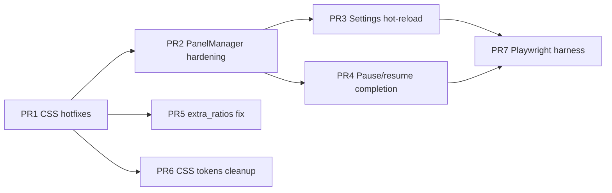

# SynDEX Panel Layout Fixes Implementation Plan

> **For agentic workers:** REQUIRED SUB-SKILL: Use superpowers:subagent-driven-development (recommended) or superpowers:executing-plans to implement this plan task-by-task. Steps use checkbox (`- [ ]`) syntax for tracking.

**Goal:** Fix PanelManager layout bugs, harden runtime behavior, and complete pause/resume coverage so panel toggles reflow the UI correctly without overlap, dead zones, or wasted CPU/GPU.

**Architecture:** Ship critical CSS corrections first (low risk), then harden `PanelManager` JS, then wire settings hot-reload and module lifecycle. A follow-up PR migrates magic `vw` combinatorics to CSS custom properties (short-term) and optionally CSS Grid (long-term). Verification is manual checklist first; optional Playwright harness in a final PR.

**Tech Stack:** Electron 41.3.0, Vanilla JS (ES5-style classes), CSS3 transitions, xterm 4.14.1, no new npm dependencies.

## Global Constraints

- All JS uses ES5-style `class` + `module.exports`, loaded via `<script>` tags in `src/ui.html`. No ES modules, no bundler.
- CSS lives in `src/assets/css/`, panel rules in `mod_panelManager.css`.
- Module classes in `src/classes/<name>.class.js`.
- Settings persist in Electron `userData/settings.json`; defaults in `src/_boot.js`.
- Panel state keys: `panelToggles` (visibility), `panelLayout.agentWatchSlot` (position).
- Keyboard shortcuts: `Ctrl+Alt+K/S/N/F/A` for keyboard / left / right / filesystem / agentWatch.
- Windows is primary target; test at 960×540 and 1920×1080.
- No new npm dependencies.
- Conventional Commits: `fix(panel): …`, `feat(panel): …`, `test(panel): …`.

---

## Audit Summary (Findings → PR Mapping)

| # | Finding | Severity | PR |
|---|---------|----------|-----|
| F1 | `panel-network-hidden` alone leaves ~16vw dead zone | Critical | PR1 |
| F2 | `panel-left-hidden` alone overlaps terminal with right column | Critical | PR1 |
| F3 | Combinatorial CSS explosion / missing state combos | High | PR1 + PR6 |
| F4 | Invalid `agentWatchSlot` not validated on load | Medium | PR2 |
| F5 | `_fitActiveTerminalSoon` stacks timeouts | Medium | PR2 |
| F6 | Settings editor changes don't apply until reload | Medium | PR3 |
| F7 | `_persist()` read-modify-write race with settings editor | Medium | PR3 |
| F8 | Hidden panels missing `pointer-events: none` | Low | PR2 |
| F9 | Dead class `agent-watch-slot-bottom-left` on `#agent_watch` | Low | PR2 |
| F10 | `extra_ratios.css` hard-hides filesystem on 5:4/4:3 | Medium | PR5 |
| F11 | Incomplete pause/resume when columns hidden (globe, clock, etc.) | Medium | PR4 |
| F12 | `register()` calls `applyLayout()` 5× at startup | Low | PR2 |
| F13 | Dual layout systems (legacy % + syndex absolute) | Tech debt | PR6 |

---

## Key Decisions

### KD1: Patch-first, grid-later

Fix the two critical single-column-hidden states with targeted CSS in PR1 before any grid migration. Users get immediate relief; grid refactor is isolated in PR6.

### KD2: Layout tokens via CSS custom properties

Introduce `--syndex-col-w`, `--syndex-gutter`, `--syndex-main-left` etc. on `body.syndex-layout` in PR1. All panel-state overrides reference tokens, not repeated magic numbers. Reduces copy-paste errors when tuning.

### KD3: Column reflow rule

When left column hidden but right visible: **slide right column into left slot** (`left: 0.8vh`), then place terminal after it. When right hidden but left visible: **expand terminal leftward** into right column slot (`left: 17.15vw`). Never share the same `left` between a visible column and `#main_shell`.

### KD4: PanelManager owns layout class application; CSS owns geometry

Keep body classes (`panel-*-hidden`, `agent-watch-*`) as the contract. JS must not set inline positions. `applyLayout()` remains the single entry point.

### KD5: Verification before merge

Every PR ends with the manual checklist in Task 7. PR7 adds optional Playwright scripts — not a merge blocker for PR1–PR5.

---

## PR Dependency Graph



| PR | Title | Est. effort |
|----|-------|-------------|
| PR1 | fix(panel): single-column-hidden layout reflow | S (2–4h) |
| PR2 | fix(panel): PanelManager validation and debounce | S (2–3h) |
| PR3 | feat(panel): apply settings without reload | S (2h) |
| PR4 | perf(panel): pause hidden column modules | M (4–6h) |
| PR5 | fix(panel): respect filesystem toggle on 5:4/4:3 | S (1h) |
| PR6 | refactor(panel): CSS layout tokens | M (3–5h) |
| PR7 | test(panel): layout regression harness | M (4–8h) |

---

## File Map

| File | Responsibility |
|------|----------------|
| `src/assets/css/mod_panelManager.css` | Panel geometry, hidden states, transitions |
| `src/classes/panelManager.class.js` | Toggle state, body classes, persist, terminal fit |
| `src/_renderer.js` | PanelManager init, shortcuts, settings editor, hot-reload hook |
| `src/_boot.js` | Default `panelToggles` / `panelLayout` |
| `src/assets/css/extra_ratios.css` | Aspect-ratio overrides (conflicts with panel manager) |
| `src/classes/locationGlobe.class.js` | WebGL globe — needs pause/resume |
| `src/classes/clock.class.js` | Interval polling |
| `src/classes/sysinfo.class.js` | Interval polling |
| `src/classes/ramwatcher.class.js` | Interval polling |
| `src/classes/hardwareInspector.class.js` | Interval polling |
| `src/classes/filesystem.class.js` | Directory polling timer |

---

## Task 1: PR1 — Critical CSS layout fixes

**Files:**
- Modify: `src/assets/css/mod_panelManager.css`

**Interfaces:**
- Consumes: existing body classes from `PanelManager.applyLayout()`
- Produces: correct geometry for all 4 single-panel-hidden states and both-column-hidden state

### Layout reference (default — all panels visible)

```
|--0.8vh--|LEFT 16.3vw|--gap--|RIGHT 16.3vw|--gap--|MAIN 65.6vw|--0.8vh--|
           0.8vh        17.15vw              33.55vw              ~99.15vw
```

### Step 1: Add layout tokens at top of syndex-layout block

- [ ] **Add CSS custom properties** immediately after `body.syndex-layout {`:

```css
body.syndex-layout {
    --syndex-gutter: 0.8vh;
    --syndex-col-w: 16.3vw;
    --syndex-col-left: var(--syndex-gutter);
    --syndex-col-right: 17.15vw;
    --syndex-main-left: 33.55vw;
    --syndex-main-w: 65.6vw;
    --syndex-bottom-h: 30vh;
    position: relative;
    display: block;
    padding-top: 0;
}
```

- [ ] **Replace hardcoded values** in base rules (lines 51–88) to use tokens. Example:

```css
body.syndex-layout section#mod_column_left {
    left: var(--syndex-col-left);
    width: var(--syndex-col-w);
    /* height unchanged */
}
body.syndex-layout section#main_shell {
    left: var(--syndex-main-left);
    width: var(--syndex-main-w);
}
```

### Step 2: Fix F1 — `panel-network-hidden` alone

- [ ] **Add rules** (after existing `panel-left-hidden` block):

```css
/* Right column hidden, left column visible: expand terminal into right column slot */
body.syndex-layout.panel-network-hidden:not(.panel-left-hidden) section#main_shell {
    left: var(--syndex-col-right);
    width: calc(100vw - var(--syndex-col-right) - var(--syndex-gutter));
}

body.syndex-layout.panel-network-hidden:not(.panel-left-hidden) section#main_shell > h3.title {
    left: var(--syndex-col-right);
    width: calc(100vw - var(--syndex-col-right) - var(--syndex-gutter));
}
```

### Step 3: Fix F2 — `panel-left-hidden` alone (no overlap)

- [ ] **Replace** existing `panel-left-hidden` main_shell rules (lines 224–231) with:

```css
/* Left column hidden, right column visible: slide right column left, terminal follows */
body.syndex-layout.panel-left-hidden:not(.panel-network-hidden) section#mod_column_right {
    left: var(--syndex-gutter);
}

body.syndex-layout.panel-left-hidden:not(.panel-network-hidden) section#mod_column_right > h3.title {
    left: var(--syndex-gutter);
    right: auto;
}

body.syndex-layout.panel-left-hidden:not(.panel-network-hidden) section#main_shell {
    left: calc(var(--syndex-gutter) + var(--syndex-col-w) + 0.25vw);
    width: calc(100vw - var(--syndex-gutter) - var(--syndex-col-w) - 0.25vw - var(--syndex-gutter));
}

body.syndex-layout.panel-left-hidden:not(.panel-network-hidden) section#main_shell > h3.title {
    left: calc(var(--syndex-gutter) + var(--syndex-col-w) + 0.25vw);
    width: calc(100vw - var(--syndex-gutter) - var(--syndex-col-w) - 0.25vw - var(--syndex-gutter));
}
```

- [ ] **Keep** existing `panel-left-hidden.panel-network-hidden` full-width rules (lines 234–241) — already correct.

### Step 4: Add `pointer-events: none` on hidden panels (F8)

- [ ] **Append** to `.panel-hidden` block:

```css
.panel-hidden {
    pointer-events: none !important;
    /* existing rules unchanged */
}
```

### Step 5: Manual verification (partial — full checklist in Task 7)

- [ ] Run: `npm start` from repo root
- [ ] Toggle right column only (`Ctrl+Alt+N`): terminal expands left, no dead zone
- [ ] Toggle left column only (`Ctrl+Alt+S`): right column slides left, no overlap on terminal
- [ ] Toggle both: terminal goes full width

- [ ] **Commit:**

```bash
git add src/assets/css/mod_panelManager.css
git commit -m "fix(panel): reflow layout when single side column hidden"
```

---

## Task 2: PR2 — PanelManager hardening

**Files:**
- Modify: `src/classes/panelManager.class.js`
- Modify: `src/_renderer.js` (line 533 — dead class)

**Interfaces:**
- Consumes: PR1 CSS classes (unchanged contract)
- Produces: `PanelManager._normalizeSlot()`, debounced `_fitActiveTerminalSoon()`, `applyLayoutFromSettings()`

### Step 1: Validate agentWatchSlot on construction (F4)

- [ ] **Add method** to `panelManager.class.js`:

```javascript
_normalizeSlot(slot) {
    if (this._agentWatchSlots.indexOf(slot) === -1) return "bottom-left";
    return slot;
}
```

- [ ] **In constructor**, after loading `_layout`:

```javascript
this._layout.agentWatchSlot = this._normalizeSlot(this._layout.agentWatchSlot || "bottom-left");
```

- [ ] **In `cycleAgentWatchSlot`**, replace indexOf logic:

```javascript
const current = this._normalizeSlot(this._layout.agentWatchSlot || "bottom-left");
const idx = this._agentWatchSlots.indexOf(current);
this._layout.agentWatchSlot = this._agentWatchSlots[(idx + 1) % this._agentWatchSlots.length];
```

- [ ] **In `applyLayout`**, normalize before adding body class:

```javascript
const slot = this._normalizeSlot(this._layout.agentWatchSlot || "bottom-left");
this._layout.agentWatchSlot = slot;
body.classList.add("agent-watch-" + slot);
```

### Step 2: Debounce terminal fit (F5)

- [ ] **Replace** `_fitActiveTerminalSoon`:

```javascript
_fitActiveTerminalSoon() {
    if (this._fitTimer) clearTimeout(this._fitTimer);
    this._fitTimer = setTimeout(() => {
        this._fitTimer = null;
        if (window.term && window.currentTerm !== undefined && window.term[window.currentTerm]) {
            window.term[window.currentTerm].fit();
        }
    }, 350);
}
```

- [ ] **Add** `this._fitTimer = null;` in constructor.

### Step 3: Defer applyLayout during registration (F12)

- [ ] **Change `register`** to not call `applyLayout` immediately:

```javascript
register(name, containerEl, module) {
    this._panels[name] = { el: containerEl, module: module || null };
    const visible = (this._state[name] !== undefined) ? this._state[name] : true;
    if (!visible) this._applyHide(name);
}
```

- [ ] **Add public method**:

```javascript
initLayout() {
    this.applyLayout();
}
```

- [ ] **In `_renderer.js`**, after all 5 `register()` calls, replace `applyLayout()` with `initLayout()`:

```javascript
window.panelMgr.initLayout();
```

### Step 4: Remove dead HTML class (F9)

- [ ] **In `_renderer.js` line 533**, change:

```html
<section id="agent_watch">
```

(remove `class="agent-watch-slot-bottom-left"` — layout is body-class driven)

### Step 5: Fix slot label replace (minor)

- [ ] **In `applyLayout`**, replace `.replace("-", " ")` with `.replace(/-/g, " ")` so `right-rail` → `right rail`.

### Step 6: Verify

- [ ] Run `npm start`
- [ ] Cycle Agent Watch slot button — label shows `bottom left`, `bottom right`, `right rail`
- [ ] Rapidly toggle panels — terminal resizes once per settle, no flicker storm
- [ ] Manually set invalid slot in settings.json → app falls back to `bottom-left` on launch

- [ ] **Commit:**

```bash
git add src/classes/panelManager.class.js src/_renderer.js
git commit -m "fix(panel): validate slots, debounce terminal fit, clean init"
```

---

## Task 3: PR3 — Settings hot-reload and persistence safety

**Files:**
- Modify: `src/classes/panelManager.class.js`
- Modify: `src/_renderer.js` (settings save handler ~line 1184)

**Interfaces:**
- Consumes: `window.settings.panelToggles`, `window.settings.panelLayout`
- Produces: `PanelManager.reloadFromSettings()`, `PanelManager.syncSettings(settings)`

### Step 1: Add reloadFromSettings to PanelManager

- [ ] **Add methods**:

```javascript
reloadFromSettings(settings) {
    settings = settings || window.settings || {};
    this._state = Object.assign({}, settings.panelToggles || {});
    this._layout = Object.assign({ agentWatchSlot: "bottom-left" }, settings.panelLayout || {});
    this._layout.agentWatchSlot = this._normalizeSlot(this._layout.agentWatchSlot);

    Object.keys(this._panels).forEach(name => {
        const visible = this._state[name] !== undefined ? this._state[name] : true;
        if (visible) this._applyShow(name);
        else this._applyHide(name);
    });
    this.applyLayout();
}

syncSettings(settings) {
    if (!settings) return;
    settings.panelToggles = Object.assign({}, this._state);
    settings.panelLayout = Object.assign({}, this._layout);
}
```

### Step 2: Change _persist to accept optional merged settings (F7)

- [ ] **Replace `_persist`**:

```javascript
_persist(mergedSettings) {
    try {
        const settings = mergedSettings || JSON.parse(this._fs.readFileSync(this._settingsFile, 'utf-8'));
        settings.panelToggles = this._state;
        settings.panelLayout = this._layout;
        this._fs.writeFileSync(this._settingsFile, JSON.stringify(settings, '', 4));
        if (window.settings) {
            window.settings.panelToggles = Object.assign({}, this._state);
            window.settings.panelLayout = Object.assign({}, this._layout);
        }
    } catch(e) {
        console.error('PanelManager: could not persist toggle state', e);
    }
}
```

### Step 3: Wire settings editor save (F6)

- [ ] **In `_renderer.js`**, after `fs.writeFileSync(settingsFile, …)` in the settings save handler (~line 1184), add:

```javascript
if (window.panelMgr && typeof window.panelMgr.reloadFromSettings === "function") {
    window.panelMgr.reloadFromSettings(window.settings);
}
```

- [ ] **In the save handler**, before write, call `window.panelMgr.syncSettings(window.settings)` so in-memory panel state is included in the full settings object.

### Step 4: Verify

- [ ] Open settings editor, hide filesystem, save — filesystem hides immediately without reload
- [ ] Change agentWatchSlot in editor, save — panel repositions
- [ ] Toggle panel via shortcut, then open settings — editor shows current values

- [ ] **Commit:**

```bash
git add src/classes/panelManager.class.js src/_renderer.js
git commit -m "feat(panel): apply panel settings without app reload"
```

---

## Task 4: PR4 — Complete pause/resume for hidden panels

**Files:**
- Modify: `src/_renderer.js` (panel register callbacks)
- Modify: `src/classes/locationGlobe.class.js`
- Modify: `src/classes/clock.class.js`
- Modify: `src/classes/sysinfo.class.js`
- Modify: `src/classes/ramwatcher.class.js`
- Modify: `src/classes/hardwareInspector.class.js`
- Modify: `src/classes/filesystem.class.js`

**Interfaces:**
- Consumes: `PanelManager._applyHide/_applyShow` calling `module.pause()/resume()`
- Produces: `pause()`/`resume()` on all polling modules

### Step 1: Add pause/resume to LocationGlobe (F11 — highest cost)

- [ ] **In `locationGlobe.class.js`**, add:

```javascript
pause() {
    this._paused = true;
    if (this.locUpdater) { clearInterval(this.locUpdater); this.locUpdater = null; }
    if (this.connsUpdater) { clearInterval(this.connsUpdater); this.connsUpdater = null; }
}

resume() {
    if (!this._paused) return;
    this._paused = false;
    if (!this.locUpdater) {
        this.locUpdater = setInterval(() => this.updateLoc(), 1000);
    }
    if (!this.connsUpdater) {
        this.connsUpdater = setInterval(() => this.updateConns(), 3000);
    }
}
```

- [ ] **In `_animate`**, early-return when `this._paused`:

```javascript
if (this._paused) return;
```

- [ ] **Set** `this._paused = false;` in constructor.

### Step 2: Add pause/resume to clock, sysinfo, ramwatcher, hardwareInspector

- [ ] **Follow cpuinfo pattern** for each module with `setInterval` updaters. Example for `clock.class.js`:

```javascript
pause() {
    if (this.updater) { clearInterval(this.updater); this.updater = null; }
}
resume() {
    if (!this.updater) {
        this.updater = setInterval(() => this.updateClock(), 1000);
    }
}
```

(Use each module's actual interval callback and period.)

### Step 3: Add pause/resume to FilesystemDisplay

- [ ] **In `filesystem.class.js`**:

```javascript
pause() {
    if (this._timer) { clearInterval(this._timer); this._timer = null; }
}
resume() {
    if (!this._timer) {
        this._timer = setInterval(() => {
            if (this._runNextTick === true) {
                this._runNextTick = false;
                this.readFS(this.dirpath);
            }
        }, 1000);
    }
}
```

### Step 4: Expand _renderer.js register callbacks

- [ ] **Replace leftColumn pause/resume**:

```javascript
pause: () => {
    ["cpuinfo","toplist","clock","sysinfo","hardwareInspector","ramwatcher"].forEach(m => {
        if (window.mods[m] && window.mods[m].pause) window.mods[m].pause();
    });
},
resume: () => {
    ["cpuinfo","toplist","clock","sysinfo","hardwareInspector","ramwatcher"].forEach(m => {
        if (window.mods[m] && window.mods[m].resume) window.mods[m].resume();
    });
}
```

- [ ] **Replace rightColumn pause/resume** to include globe:

```javascript
pause: () => {
    ["netstat","conninfo","globe"].forEach(m => {
        if (window.mods[m] && window.mods[m].pause) window.mods[m].pause();
    });
},
resume: () => {
    ["netstat","conninfo","globe"].forEach(m => {
        if (window.mods[m] && window.mods[m].resume) window.mods[m].resume();
    });
}
```

- [ ] **Register filesystem** with pause/resume adapter:

```javascript
window.panelMgr.register('filesystem', document.getElementById('filesystem'), {
    pause: () => { if (window.fsDisp && window.fsDisp.pause) window.fsDisp.pause(); },
    resume: () => { if (window.fsDisp && window.fsDisp.resume) window.fsDisp.resume(); }
});
```

### Step 5: Verify

- [ ] Run app, open DevTools → Performance
- [ ] Hide right column — globe rAF loop stops, netstat intervals cleared
- [ ] Show right column — globe resumes
- [ ] Hide filesystem — directory polling stops

- [ ] **Commit:**

```bash
git add src/_renderer.js src/classes/locationGlobe.class.js src/classes/clock.class.js src/classes/sysinfo.class.js src/classes/ramwatcher.class.js src/classes/hardwareInspector.class.js src/classes/filesystem.class.js
git commit -m "perf(panel): pause polling modules when parent panel hidden"
```

---

## Task 5: PR5 — Fix extra_ratios.css filesystem override

**Files:**
- Modify: `src/assets/css/extra_ratios.css`

**Interfaces:**
- Consumes: `body.panel-filesystem-hidden` from PanelManager
- Produces: filesystem hidden only when panel manager says so

### Step 1: Replace hard display:none (F10)

- [ ] **Replace** in `@media (aspect-ratio: 5/4), (aspect-ratio: 4/3)` block:

```css
/* Was: section#filesystem { display: none; } */
section#filesystem {
    width: 28vw;
}
body.syndex-layout.panel-filesystem-hidden section#filesystem {
    display: none;
}
```

- [ ] **Add comment** explaining panel manager owns visibility.

### Step 2: Verify on 4:3 or emulate in DevTools

- [ ] DevTools → Rendering → Emulate CSS media feature `aspect-ratio: 4/3`
- [ ] Filesystem visible by default
- [ ] `Ctrl+Alt+F` hides it

- [ ] **Commit:**

```bash
git add src/assets/css/extra_ratios.css
git commit -m "fix(panel): respect filesystem toggle on 4:3 and 5:4 displays"
```

---

## Task 6: PR6 — CSS tokens cleanup (optional follow-up)

**Files:**
- Modify: `src/assets/css/mod_panelManager.css`
- Modify: `src/assets/css/mod_column.css` (remove conflicting `width: 17%` when syndex-layout active)

**Scope:** Refactor remaining hardcoded `vw` values in agent-watch and bottom-panel combo rules to use tokens. Add scoped override:

```css
body.syndex-layout section.mod_column {
    width: var(--syndex-col-w);
}
```

Out of scope for PR1–PR5: full CSS Grid migration. If pursued later, define grid areas:

```
| left | right | main |
| fs   | agent | kb   |
```

and toggle `display:none` / `grid-area` instead of combinatorial body classes.

- [ ] **Commit:**

```bash
git commit -m "refactor(panel): consolidate layout dimensions into CSS tokens"
```

---

## Task 7: Manual verification checklist (required for every PR)

- [ ] **Default layout:** all panels visible, no overflow at 1920×1080 and 960×540
- [ ] **Ctrl+Alt+S** (left only hidden): right column at left edge, terminal fills remainder, no overlap
- [ ] **Ctrl+Alt+N** (right only hidden): terminal expands into right column area, no 16vw gap
- [ ] **Ctrl+Alt+S then Ctrl+Alt+N** (both hidden): terminal full width
- [ ] **Ctrl+Alt+F** (filesystem hidden): agent watch repositions per CSS
- [ ] **Ctrl+Alt+K** (keyboard hidden): terminal height expands, bottom panels unaffected
- [ ] **Ctrl+Alt+A** (agent watch hidden): filesystem widens
- [ ] **Agent Watch slot button:** cycles bottom-left → bottom-right → right-rail, label updates
- [ ] **Window resize:** terminal `fit()` fires, layout intact
- [ ] **Settings editor:** panel toggles apply live on save
- [ ] **Persist:** restart app, panel states restored
- [ ] **4:3 emulation:** filesystem respects toggle

---

## Task 8: PR7 — Playwright layout regression harness (optional)

**Files:**
- Create: `tests/panel-layout.spec.js` (or `scripts/verify-panel-layout.js` using playwright-interactive skill patterns)
- Modify: `package.json` (add `"test:layout"` script — devDependency only if user approves; plan default uses standalone script with existing electron)

**Approach:** Launch SynDEX with `--nointro`, inject test hooks via `webContents.executeJavaScript`:

```javascript
// Assert no overlap: right column right edge <= main_shell left edge
function assertNoColumnOverlap() {
    const right = document.getElementById('mod_column_right');
    const main = document.getElementById('main_shell');
    if (right.classList.contains('panel-hidden')) return true;
    const r = right.getBoundingClientRect();
    const m = main.getBoundingClientRect();
    return r.right <= m.left + 2; // 2px tolerance
}
```

- [ ] **Write** test cases for F1 and F2 scenarios
- [ ] **Document** run instructions in plan README

> **Note:** SynDEX has no test runner today. This PR is optional and should not block PR1–PR5.

---

## Execution Handoff

**Plan saved to:** `docs/superpowers/plans/2026-06-29-syndex-panel-layout-fixes.md`

**Recommended execution order:** PR1 → PR2 → PR3 → PR5 (parallel with PR4) → PR4 → PR6 (optional) → PR7 (optional)

**Two execution options:**

1. **Subagent-Driven (recommended)** — Fresh subagent per PR, review between PRs using `requesting-code-review` skill
2. **Inline Execution** — Implement PR1–PR3 in this session using `executing-plans`, checkpoint after each PR

**Which approach?**